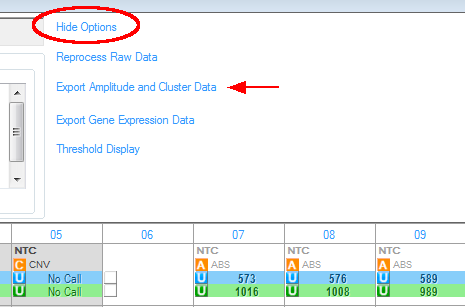

## Synopsis

A suite of tools based on the *still under development* `virustiter` package to analyze BioRad digital PCR data. This requires installing the `cutoff` package by N. T. Choisy from GitHub (as of December 2017). The code to do this is `devtools::install_github("choisy/cutoff"). The `cutoff` package requires several dependencies including one that it fails to automatically load: `bblme`.

In addition to `cutoff`, the `ddpcr` package here requires the `bblme`, `diptest`, `lattice` and `MASS` packages and suggests the `genefilter` package from the BioConductor.  

## Overview

This is a quick attempt to adapt the virus titer code to process two channel ddPCR results.

Data must be exported as CSV files from QuantaSoft. After loading the data, select the "Setup" tab, click on the "Options" link on the right panel to reveal the options. The link will change to "Hide Options." Use the "Export Amplitude and Cluster Data" link to export the CSV files to a selected directory.



The data in this directory will be merged with phenotype data to identify positive drops and make the data accessible as a data frame in R. 

The key function implemented here is `findBgnd()` which is the logic behind `getCut()` to determine the cutoff thresholds. If the population shows evidence of being bimodal, code from the package `cutoff` is used to determine the break point. This code has the potential to accommodate various distributions including Gaussian such as log-normal, Poisson, Weibull, and more for the left and right populations. However, this implementation assumes both populations can be described by a Gaussian curve. If most of the drops are negative and the distribution appears symmetrical, the population is assumed to be Gaussian and the mean and standard deviation are determined directly. If the distribution of the negative population appears asymmetric with positive samples to the right, the option `asym == TRUE` directs to code to use the left half of the population peak to determine the "true" mean and standard deviation of the negative population with `genefilter::half.range.mode()` function. The cutoff for a unimodal population is set at a default value of 6&sigma; above the mean but the multiplier (6) can be changed by the user. 

There is no code for handling outlying or indeterminate values. These can be handled with the usual tools in R. 

## Installation

**This is NOT meant for installation as an R package just yet.** After ensuring that the dependencies mentioned above are available, this repository can be cloned and "installed" locally by setting `path` to the local directory with `devtools::load_all(path)`. (The `devtools` package may have to be installed as well.)

## Working notes

Phenotype data should be a data frame with the variable `well` as a factor such as "A1" or "A01" where the case and zeros used for padding are ignored.

Additional properties can be placed in the phenotype data frame as factor variables. These will be merged with the raw data. 

After ensuring the packages have been installed, the sample work flow below can be run by copying and pasting the text. The sample data are from a demonstration run at Wake Forest University on December 4, 2017.  

```
## select any CSV file within the directory of files exported by QuantaSoft
  fd <- system.file("extdata",
    "20171204_DEMO_ORNELLES_A01_Amplitude.csv", package = "ddpcr")

## load phenotype data, here as a data frame named 'pd'
  data(pd)  # load phenotype data frame

## read data, merge with phenotype data, determine cutoff and score
  df <- readData(fd)      # read values into data frame
  df <- mergeData(pd, df) # merge with phenotype data
  cut <- getCut(df, mult = c(5, 8)) # determine cutoff with adjustments
  df <- score(df, cut)    # determine positives and quadrants

## filter outliers
  df <- subset(df, ch1 < 600)   # HAdV probe in FAM
  df <- subset(df, ch2 < 2000)  # CMV probe in HEX

## plot QuantaSoft-style 1-dimension result (with lattice)
	plot1d(df, column == "1")

## tally results to see total events, total positive and Poisson number
  tally(df)  # tally(df, pd) merges results with phenotype data

## One interesting sample displayed with lattice
  tp <- trellis.par.get()
  tp$superpose.symbol <- list(alpha = 0.5, col = c("gray", "#0080ff", "#ff00ff", "darkgreen"),
    fill = c("gray", "#0080ff", "#ff00ff", "darkgreen"), pch = c(1, 21, 21, 21))
  obj <- xyplot(ch1 ~ ch2 | sample + well:donor, df, subset = well == "A02", groups = quad)
  obj <- update(obj, panel = function(...) {panel.grid(h = -1, v = -1); panel.superpose(...)})
  obj <- update(obj, xlab = "CMV (ch2, HEX) amplitude", ylab = "HAdV (ch1, FAM) amplitude")
  obj <- update(obj, par.settings = tp)
  plot(obj)
```
Supporting functions to be migrated sometime:
```
plotCut(df)    # show cutoff values with densityplot 
plotHist(df)   # show cutoff values with histogram
```  
## License

GPL-3
